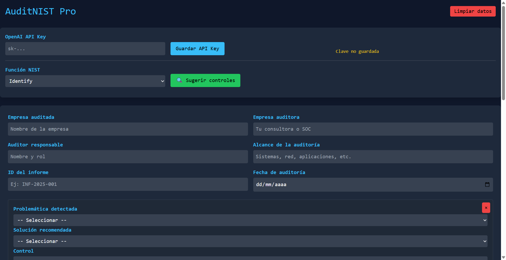
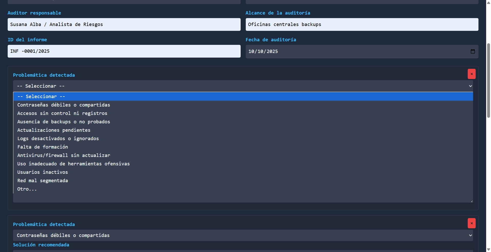
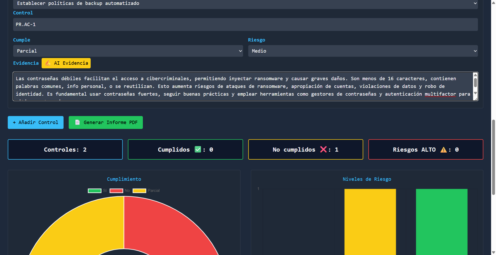

# 🔐 AuditNIST - AI-Powered Cybersecurity Audit Platform

> Enterprise-grade NIST CSF compliance auditing with integrated AI assistance built on a local-first architecture.

[🇬🇧 English](#english) | [🇪🇸 Español](#español)

---

## 🎯 Overview
### Vision

AuditNIST is evolving into a modular, framework-agnostic cybersecurity audit engine designed for modern GRC teams.  
Built on a local-first architecture, it combines structured audit workflows with AI-assisted documentation — without making AI a hard dependency.

**AuditNIST** is a professional cybersecurity auditing platform designed for security consultants, GRC teams, and SOC analysts. It streamlines NIST Cybersecurity Framework assessments with AI-powered control suggestions and automated evidence generation.

🔧 **AI Provider Configuration** — AuditNIST supports multiple AI providers through a clean abstraction layer, with local inference enabled by default.


---

## ✨ Key Features

- 🤖 **AI-Powered Control Suggestions** - Intelligent NIST CSF control recommendations
- 📝 **Automated Evidence Generation** - Transform audit notes into formal documentation
- 📊 **Real-Time Dashboards** - Live compliance and risk visualization
- 📄 **Professional Reporting** - Automated PDF/TXT export
- 💾 **Persistent Storage** - Save and resume audits anytime
- 🎨 **Modern UI** - Dark-mode cybersecurity-themed interface
- 🔒 **Privacy-First** - Local data processing, no external dependencies
- 📱 **Responsive Design** - Works on desktop and tablet


## 📷 Screenshots

  
  
  
https://youtu.be/TtRU8qN4AUc


## 🛠️ Tech Stack

### Core Technologies
- **Frontend**:  JavaScript (ES6+), HTML5, CSS3
- **Styling**: Tailwind CSS with custom cybersecurity theme
- **Charts**: Chart.js for data visualization
- **PDF Generation**: jsPDF
- **File Export**: FileSaver.js


### AI Integration

- Default Local Model: qwen2.5:3b (via Ollama)
- Language-aware prompts
- Provider abstraction layer (generateAI → provider)
- Future-ready for cloud provider integration

## 🧠 Architecture Philosophy

- **Local-first by design** — Sensitive audit data remains under full user control.
- **AI as an assistive layer** — Core audit workflows function independently of AI.
- **Framework-ready architecture** — Designed to support multiple compliance frameworks.
- **Modular risk logic** — Clear separation between control status, derived risk, and reporting layer.
---

## 📦 Installation

### Option 1: AuditNIST Local (Recommended for sensitive data)

#### Prerequisites
```bash
# 1. Install Ollama
curl -fsSL https://ollama.ai/install.sh | sh

# 2. Download model qwen2.5:3b
ollama pull  qwen2.5:3b

# 3. Start Ollama service
ollama serve
```

#### Launch Application
```bash
# Clone repository
git clone https://github.com/SUALBA/AudiNist_Pro.git
cd AudiNist_Pro

# Open auditnist-local.html directly in your browser

# (Optional) Run a simple static server if needed
npx serve .
# or
python -m http.server 8080

# Then open:
# http://localhost:8080/auditnist-local.html
```


## 🎯 Quick Start Guide

### 1. Setup Audit Metadata
```
✓ Company being audited
✓ Auditing company/consultant
✓ Auditor name and role
✓ Audit scope (systems, networks, apps)
✓ Report ID and date
```

### 2. Generate AI Control Suggestions
```javascript
1. Select NIST CSF Function: Identify | Protect | Detect | Respond | Recover
2. Click "🔍 Suggest Controls"
3. AI generates relevant controls (e.g., PR.AC-1, DE.CM-7)
4. Click suggested controls to add to audit
```

### 3. Document Findings
```
For each control:
- Select problem from taxonomy or add custom
- Choose recommended solution
- Set compliance status: Yes / No / Partial
- Assign risk level: High / Medium / Low
- Document evidence (manual or AI-generated)
```

### 4. Generate Reports
```
📄 PDF Report - Professional audit document
📄 TXT Export - Plain text for integration
💾 Save Progress - Resume later
```

---

## 🤖 AI Features Deep Dive

### Intelligent Control Suggestions

The AI analyzes NIST CSF functions and recommends relevant controls:

**Example Input:**
```
Function: "Protect"
```

**AI Output:**
```json
[
  {"code": "PR.AC-1", "name": "Identity and Access Management"},
  {"code": "PR.AT-1", "name": "Security Awareness Training"},
  {"code": "PR.DS-1", "name": "Data-at-Rest Protection"},
  {"code": "PR.IP-1", "name": "Baseline Configuration"},
  {"code": "PR.PT-1", "name": "Audit Logging"}
]
```

### Automated Evidence Generation

Transform brief notes into formal audit evidence:

**Input (Your notes):**
```
"Found weak passwords in domain controller"
```

**AI Output (Formal evidence):**
```
During the security assessment conducted on [date], a comprehensive 
review of authentication mechanisms revealed multiple user accounts 
configured with insufficient password complexity requirements. 
Specifically, the domain controller authentication policies were 
found to permit passwords shorter than 12 characters without 
enforcing special character requirements, constituting a significant 
security risk under NIST PR.AC-1 guidelines.
```

---

## 📊 Data Architecture

## Architecture

To understand the internal design of the project:

- 📊 [Architecture Dashboard](docs/architecture-dashboard.html)
- 📄 [AuditEngine Core Specification](docs/AuditEngine-Core-v1-Spec.md)

### Audit Report Structure
```javascript
{
  metadata: {
    empresa_auditada: "Acme Corp",
    empresa_auditora: "CyberSec Consultants",
    auditor: "Jane Doe, CISSP",
    alcance: "Network infrastructure, Active Directory",
    id_informe: "AUD-2025-001",
    fecha: "2025-10-09"
  },
  controls: [
    {
      problem: "Weak password policies",
      solution: "Implement 12+ char passwords with complexity",
      control: "PR.AC-1",
      compliance: "No",
      risk: "High",
      evidence: "Formal audit evidence text..."
    }
  ]
}
```

### Storage
- **Local**: Browser `localStorage` (encrypted by browser)
- **Export**: PDF and TXT files
- **Privacy**: No data leaves your machine (Local version)

---

## 🎨 UI Components

### Dashboard Widgets
1. **Control Counter** - Total controls assessed
2. **Compliance Status** - ✅ Compliant / ❌ Non-compliant breakdown
3. **Risk Distribution** - High/Medium/Low risk count
4. **Compliance Chart** - Doughnut chart visualization
5. **Risk Chart** - Bar chart by severity

### Interactive Forms
- **Dynamic Control Blocks** - Add/remove as needed
- **Dropdown Taxonomies** - Pre-defined problems and solutions
- **AI Assist Buttons** - One-click AI enhancement
- **Real-time Updates** - Charts update as you work

---

## 🔐 Security & Privacy

### Data Protection
- ✅ **Local Processing** - All data stays on your machine
- ✅ **No Cloud Dependencies** - Local version works offline
- ✅ **Browser Encryption** - localStorage encrypted by browser
- ✅ **No Tracking** - Zero analytics or telemetry

### Compliance
Suitable for organizations operating under:
- GDPR
- HIPAA-regulated environments
- SOC 2 reporting contexts
- ISO 27001-aligned audits

---

## 🚀 Use Cases

### 1. Security Consultants
```
✓ Conduct client audits efficiently
✓ Generate professional reports instantly
✓ Maintain audit consistency across clients
✓ Significantly reduce documentation time
```

### 2. GRC Teams
```
✓ Quarterly compliance assessments
✓ Gap analysis documentation
✓ Risk management workflows
✓ Audit evidence repository
```

### 3. SOC Analysts
```
✓ Incident response documentation
✓ Control effectiveness testing
✓ Compliance monitoring
✓ Executive reporting
```

### 4. Educational
```
✓ Teach NIST CSF framework
✓ Practical audit training
✓ Cybersecurity curriculum
✓ Certification preparation
```

---

## 📈 Roadmap

### Current Version (v1.1.0)
- ✅ Core audit functionality
- ✅ AI control suggestions
- ✅ AI evidence generation
- ✅ PDF/TXT export
- ✅ Local data persistence
- ✅ Multi-language support (7 languages including RTL)


### Planned Features (v2.0)
- [ ] Multi-framework engine (ISO 27001, CIS Controls, COBIT)
- [ ] Template library (by industry vertical)
- [ ] Collaborative audits (multi-user)
- [ ] Excel export with pivot tables
- [ ] Risk scoring calculator
- [ ] Maturity model assessment
- [ ] Integration with SIEM platforms
- [ ] Mobile app (iOS/Android)

### Future Enhancements
- [ ] Automated remediation tracking
- [ ] Compliance timeline visualization
- [ ] Email reporting automation
- [ ] API for external integrations
- [ ] OpenAI GPT Models and API


## v1.1.0

- i18n system refactor (internal value stabilization)
- Multi-language support (7 languages including RTL)
- Architectural decoupling of UI labels and logic

Contributor: Vandan Panwala

---

## 🤝 Contributing

We welcome contributions! Here's how to get involved:

### Development Setup
```bash
# Fork the repository
git clone https://github.com/SUALBA/AudiNist_Pro

# Create feature branch
git checkout -b feature/new-capability

# Make changes and test thoroughly

# Submit pull request with detailed description
```

### Contribution Ideas
- 🐛 **Bug Reports** - Found an issue? Let us know
- ✨ **Feature Requests** - Suggest improvements
- 📝 **Documentation** - Help improve guides
- 🌍 **Translations** - Add language support
- 🎨 **UI/UX** - Design enhancements
- 🔒 **Security** - Vulnerability reports

### Code Standards
- ES6+ JavaScript syntax
- 2-space indentation
- JSDoc function documentation
- Comprehensive error handling
- Mobile-responsive design

---

## 📜 License

This project is licensed under the **MIT License**.

```
MIT License - Free for personal and commercial use
Modify, distribute, and use freely
Attribution appreciated but not required
```

See [LICENSE](LICENSE) file for full details.

---

## 🙏 Acknowledgments

- **NIST** - Cybersecurity Framework taxonomy
- **Ollama Team** - Local AI infrastructure
- **Chart.js Community** - Visualization library
- **Tailwind CSS** - Utility-first styling

---

## 💬 Support & Contact

### Get Help
- 📧 Email: sualba.dev@gmail.com
- 🌐 Website: [www.sualba.dev](https://www.sualba.dev)
- 💼 LinkedIn: [Connect with developer](https://linkedin.com/)
- 🐛 Issues: [GitHub Issues](https://github.com/SUALBA/AudiNist_Pro/issues)

### Commercial Support
Enterprise support packages available for:
- Custom feature development
- Priority bug fixes
- Training and onboarding
- Integration assistance

---

## ⭐ Show Your Support

If AuditNIST helps your work:
- ⭐ **Star this repository**
- 🔀 **Fork for your projects**
- 📢 **Share with your network**
- 💬 **Provide feedback**

---

## 📚 Additional Resources

### NIST CSF Resources
- [NIST Cybersecurity Framework](https://www.nist.gov/cyberframework)
- [CSF Implementation Guide](https://www.nist.gov/document/cybersecurity-framework-implementation-guidance)
- [CSF Online Learning](https://www.nist.gov/itl/applied-cybersecurity/nice/resources/online-learning-content)

### Related Frameworks
- [ISO/IEC 27001](https://www.iso.org/isoiec-27001-information-security.html)
- [CIS Controls](https://www.cisecurity.org/controls)
- [COBIT 5](https://www.isaca.org/resources/cobit)
- [PCI-DSS](https://www.pcisecuritystandards.org/)

---

**Built with 💻 and ☕ for security professionals worldwide**

---
**Note**: This tool is designed for professional cybersecurity assessments. Ensure compliance with your organization's data handling policies and regulatory requirements.

---

## Español

> Herramienta de auditoría de cumplimiento del Marco de Ciberseguridad NIST de nivel empresarial con asistencia de IA integrada


[](LICENSE)
[](https://www.nist.gov/cyberframework)

## Resumen

AuditNIST Local es una plataforma integral de auditoría de ciberseguridad diseñada para profesionales de seguridad que realizan evaluaciones del Marco de Ciberseguridad NIST. Construido con un enfoque en la privacidad de datos y capacidades offline, proporciona sugerencias inteligentes de controles y generación automatizada de evidencias a través de integración local de IA.

### Características Principales

- **🔐 Arquitectura Centrada en la Privacidad**: Todo el procesamiento de datos ocurre localmente sin dependencias externas
- **🤖 Insights Potenciados por IA**: Integración con Ollama/model qwen2.5:3b' para sugerencias inteligentes de controles y generación de evidencias
- **📊 Análisis en Tiempo Real**: Dashboards dinámicos de cumplimiento y visualización de riesgos
- **📄 Reportes Profesionales**: Generación automatizada de informes PDF y TXT
- **💾 Almacenamiento Persistente**: Persistencia local de datos con capacidades de importación/exportación
- **🎨 Interfaz Moderna**: UI responsiva en modo oscuro optimizada para profesionales de seguridad

## Arquitectura Técnica

### Stack Frontend
- **Framework**: JavaScript con características modernas ES6+
- **Estilos**: Tailwind CSS con tema personalizado de ciberseguridad
- **Gráficos**: Chart.js para visualización de cumplimiento y riesgos
- **Generación PDF**: jsPDF para salida de informes profesionales
- **Gestión de Archivos**: FileSaver.js para capacidades de exportación de datos

### Integración IA
- **Modelo**: Ollama con model qwen2.5:3b (despliegue local)
- **Endpoint**: `http://localhost:11434/api/generate`
- **Casos de Uso**: Sugerencias de controles, generación de evidencias, análisis de cumplimiento

### Arquitectura de Datos
```
InformeAuditoria {
  metadatos: {
    empresa_auditada: string,
    empresa_auditora: string,
    auditor: string,
    alcance: string,
    id_informe: string,
    fecha: date
  },
  controles: [
    {
      problema: string,
      solucion: string,
      id_control: string,
      estado_cumplimiento: enum,
      nivel_riesgo: enum,
      evidencia: string
    }
  ]
}
```

## Instalación y Configuración

### Prerrequisitos
- Navegador web moderno (Chrome 90+, Firefox 88+, Safari 14+)
- Ollama instalado y ejecutándose localmente
- Modelo: qwen2.5:3b descargado vía Ollama

### Inicio Rápido
1. **Clonar el repositorio**
   ```bash
   git clone https://github.com/SUALBA/AudiNist_Pro
   cd auditnist_Pro
   ```

2. **Instalar Ollama** (si no está ya instalado)
   ```bash
   curl -fsSL https://ollama.ai/install.sh | sh
   ```

3. **Descargar modelo qwen2.5:3b'**
   ```bash
   ollama pull qwen2.5:3b
   ```

4. **Iniciar servicio Ollama**
   ```bash
   ollama serve
   ```

5. **Lanzar AuditNIST_Pro Local**
   ```bash
   # Opción 1: Servidor HTTP simple
   python -m http.server 8080
   
   # Opción 2: Servidor Node.js
   npx serve .
   
   # Opción 3: Abrir directamente en navegador
   open auditnist-local.html
   ```

## Guía de Uso

### Flujo de Trabajo Básico

1. **Configuración del Proyecto**
   - Configurar metadatos de auditoría (detalles de empresa, alcance, información del auditor)
   - Establecer fecha de auditoría e ID del informe

2. **Gestión de Controles**
   - Añadir controles manualmente o usar sugerencias de IA
   - Seleccionar función NIST CSF (Identificar, Proteger, Detectar, Responder, Recuperar)
   - Generar recomendaciones inteligentes de controles

3. **Proceso de Evaluación**
   - Documentar problemas identificados desde taxonomía predefinida
   - Registrar soluciones recomendadas
   - Establecer estado de cumplimiento (Sí/No/Parcial)
   - Asignar niveles de riesgo (Alto/Medio/Bajo)

4. **Documentación de Evidencias**
   - Entrada manual de evidencias
   - Generación de evidencias asistida por IA desde notas
   - Formato estructurado de evidencias

5. **Reportes y Exportación**
   - Generar informes PDF profesionales
   - Exportar datos brutos como archivos TXT
   - Guardar progreso para continuación posterior

### Características de IA

#### Sugerencias Inteligentes de Controles
```javascript
// Ejemplo: Generar controles para función "Proteger"
const sugerencias = await suggestControls("Protect");
// Devuelve: PR.AC-1, PR.AT-1, PR.DS-1, etc.
```

#### Generación Automatizada de Evidencias
```javascript
// Ejemplo: Transformar notas en evidencia formal
const evidencia = await autoFillEvidence("Se encontraron contraseñas débiles en controlador de dominio");
// Devuelve: "Durante la evaluación, se identificaron múltiples cuentas de usuario con políticas de contraseña débiles..."
```

### Configuración Avanzada

#### Categorías de Problemas Personalizados
Extender la taxonomía de problemas predefinida:
```javascript
const PROBLEMAS_PERSONALIZADOS = [
  "Brechas en arquitectura zero-trust",
  "Configuraciones erróneas de seguridad en contenedores",
  "Vulnerabilidades de seguridad en APIs"
];
```

#### Personalización del Modelo IA
Modificar parámetros de integración IA:
```javascript
const CONFIG_IA = {
  model:'qwen2.5:3b',
  temperature: 0.7,
  max_tokens: 1000,
  endpoint: 'http://localhost:11434/api/generate'
};
```

## Referencia de API

### Funciones Principales

#### `addControl()`
Crea un nuevo bloque de evaluación de control con todos los campos requeridos.

#### `suggestControls(funcion)`
- **Parámetros**: `funcion` - Función NIST CSF (Identificar/Proteger/Detectar/Responder/Recuperar)
- **Devuelve**: Array de controles sugeridos con códigos y descripciones
- **Dependencia IA**: Requiere servicio Ollama

#### `autoFillEvidence(boton)`
- **Parámetros**: `boton` - Elemento DOM que dispara la acción
- **Contexto**: Usa contenido de textarea adyacente como entrada
- **Devuelve**: Texto de evidencia formateado
- **Dependencia IA**: Requiere servicio Ollama

#### `generatePDF()`
Crea informe PDF integral con:
- Resumen ejecutivo
- Detalles de evaluación de controles
- Estado de cumplimiento
- Análisis de riesgos
- Documentación de evidencias

#### `exportToTXT()`
Genera informe en texto plano para integración con sistemas externos.

### Gestión de Datos

#### `saveProgress()`
Persiste estado actual de auditoría en localStorage con identificador único.

#### `loadProgress(id)`
Restaura sesión de auditoría previamente guardada.

#### `clearData()`
Reinicia estado de aplicación y elimina todos los datos ingresados.

## Consideraciones de Seguridad

### Privacidad de Datos
- **Procesamiento Local**: Todos los datos sensibles permanecen en la máquina local
- **Sin APIs Externas**: Cero dependencia de servicios en la nube para funcionalidad principal
- **Cifrado**: Datos de localStorage cifrados por defecto por el navegador

### Seguridad de Red
- **Capacidad Offline**: Funcionalidad principal funciona sin conectividad a internet
- **IA Local**: Procesamiento de IA ocurre completamente en máquina local
- **Listo para HTTPS**: Compatible con entornos de hosting seguros

## Optimización de Rendimiento

### Compatibilidad de Navegadores
- Características modernas de JavaScript con soporte de respaldo
- Diseño responsivo para uso en escritorio y tablet
- Renderizado optimizado de gráficos para conjuntos de datos grandes

### Gestión de Memoria
- Manipulación eficiente del DOM
- Carga perezosa de componentes de gráficos
- Manejo de eventos amigable con recolección de basura

## Resolución de Problemas

### Problemas Comunes

**Características de IA No Funcionan**
- Verificar que Ollama esté ejecutándose: `curl http://localhost:11434/api/version`
- Verificar disponibilidad del modelo: `ollama list`
- Asegurar que qwen2.5:3b esté descargado: `ollama pull qwen2.5:3b`

**Errores de Generación PDF**
- Verificar carga de librería jsPDF
- Revisar consola del navegador para errores JavaScript
- Asegurar memoria suficiente del navegador para informes grandes

**Problemas de Visualización de Gráficos**
- Confirmar disponibilidad de librería Chart.js
- Verificar inicialización de elemento canvas
- Verificar compatibilidad de formato de datos

### Modo Debug
Habilitar logging detallado:
```javascript
window.DEBUG = true;
// Salida adicional de consola estará disponible
```

## Contribuir

### Configuración de Desarrollo
1. Hacer fork del repositorio
2. Crear rama de característica: `git checkout -b feature/nombre-mejora`
3. Implementar cambios con pruebas apropiadas
4. Enviar pull request con descripción detallada

### Estándares de Código
- Sintaxis JavaScript ES6+
- Indentación consistente (2 espacios)
- Manejo integral de errores
- Documentación JSDoc para funciones
- Principios de diseño responsivo

## Licencia

Este proyecto está licenciado bajo la Licencia MIT - ver el archivo [LICENSE](LICENSE) para detalles.

## Reconocimientos

- Marco de Ciberseguridad NIST por taxonomía de controles de seguridad
- Equipo Ollama por infraestructura de IA local
- Comunidad Chart.js por componentes de visualización
- Tailwind CSS por framework de estilos moderno

## Soporte

Para soporte técnico o solicitudes de características:
- Crear un issue en GitHub
- Contacto: [tu-email@empresa.com]
- Documentación: [url-wiki-proyecto]

---

**Nota**: Esta herramienta está diseñada para evaluaciones profesionales de ciberseguridad. Asegúrese del cumplimiento con las políticas de manejo de datos de su organización y requisitos regulatorios.

