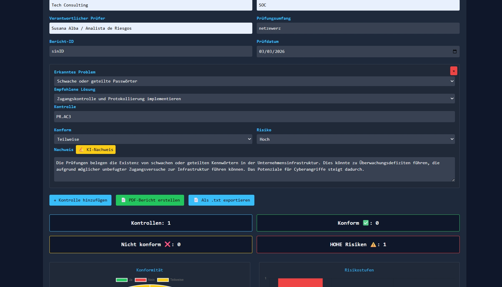
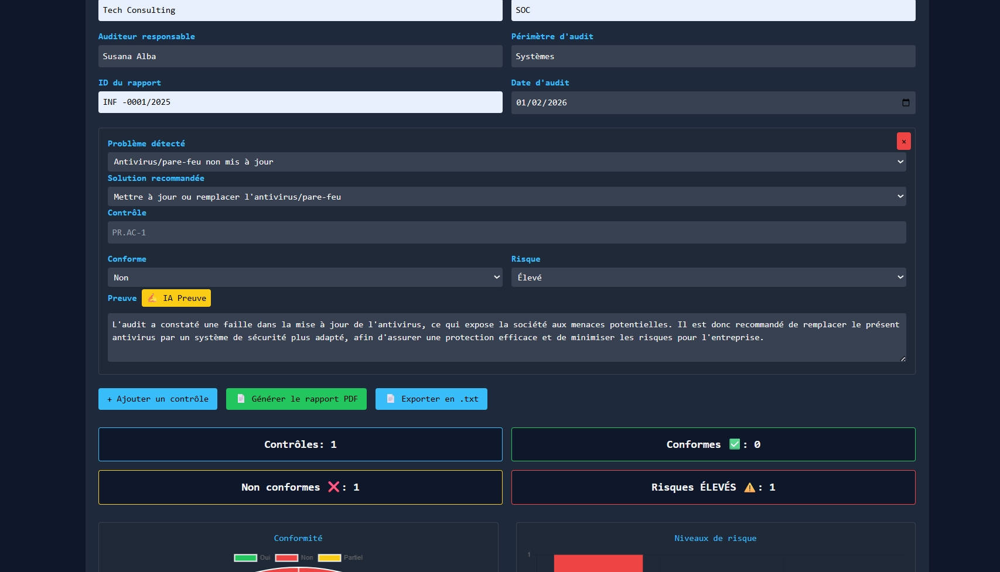
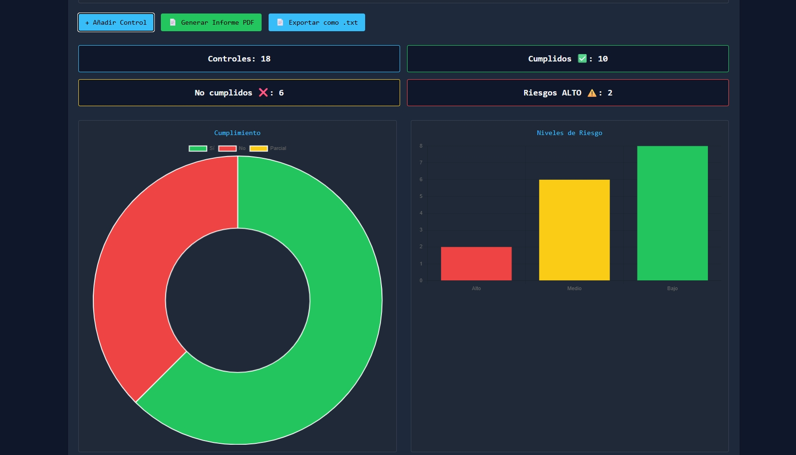

# 🔐 AuditNIST Pro

Lightweight Cybersecurity Audit Tool based on the NIST Cybersecurity Framework

---

🌍 **Language**

[🇬🇧 English](#english) | [🇪🇸 Español](#español)

---

# 🇬🇧 AuditNIST Pro

## 🎥 Demo Video

[Watch the demo] https://www.youtube.com/watch?v=vEh4ZBExcDc

---

## 📸 Application Screenshots

  
  
  
  

  
  
  

---

## What is AuditNIST Pro

**AuditNIST Pro** is a lightweight cybersecurity audit tool designed to simplify the practical use of the **NIST Cybersecurity Framework (CSF)**.

Security frameworks provide excellent guidance but are often difficult to apply during real security assessments due to their complexity.

AuditNIST Pro transforms framework subcategories into **clear evaluation units**, allowing auditors to perform assessments using a simple and structured workflow.

Instead of navigating hundreds of pages of documentation, auditors can evaluate each control directly through a **practical checklist interface**.

---

## Why this Project Exists

Many cybersecurity frameworks are extremely valuable but not easy to operationalize.

Auditors often face problems such as:

- excessive documentation
- fragmented controls
- difficulty tracking evaluation results
- lack of simple assessment tools

AuditNIST Pro was created to bridge that gap by transforming the framework structure into a **usable audit interface**.

---

## How the Audit Works

Typical audit workflow:

Load NIST Framework
↓
Generate Control List
↓
Evaluate Controls
↓
Add Notes & Evidence
↓
Assign Risk Level
↓
Generate Audit Summary

Each NIST CSF subcategory becomes a **practical evaluation checkpoint**.

Auditors can record:

- compliance status
- audit notes
- supporting evidence
- risk indication

---

## Architecture

Although the interface appears simple, the application is built around a modular architecture.

AuditNIST Pro (Application Layer)
│
▼
AuditEngine (Core Logic)
│
├── Evaluation Manager
├── Risk Engine
└── Reporting Engine
│
▼
Framework Adapter
│
└── NIST CSF

---

## AuditEngine

At the core of the application is an internal component called **AuditEngine**.

AuditEngine manages:

- audit session logic
- control evaluation
- risk scoring
- report generation

By separating the engine from the interface, the system can evolve into a **multi-framework audit platform** in the future.

---

## Optional AI Assistance

The project also explores the integration of **local AI models** to assist auditors.

Possible uses include:

- explaining framework controls
- suggesting remediation actions
- summarizing audit results

AI assistance is **optional** and does not replace the auditor's decision-making.

---

## Project Status

AuditNIST Pro is currently an **experimental MVP** under development.

The goal is to explore how cybersecurity frameworks can be transformed into **practical auditing tools**.

---

## Roadmap

**v0.1**

- NIST CSF audit interface
- manual evaluation
- basic risk indication

**v0.2**

- improved reporting
- exportable audit summaries

**v0.3**

- AI assistance
- visual audit dashboards

---

# 🇪🇸 AuditNIST Pro

## 🎥 Vídeo de demostración

https://www.youtube.com/watch?v=AAjXmnYRUgI

---

## 📸 Capturas de la aplicación

  
  
  

---

## Qué es AuditNIST Pro

**AuditNIST Pro** es una herramienta ligera de auditoría de ciberseguridad diseñada para facilitar el uso práctico del **NIST Cybersecurity Framework (CSF)**.

Los frameworks de seguridad ofrecen guías muy valiosas, pero en la práctica suelen ser difíciles de aplicar durante auditorías reales debido a su complejidad.

AuditNIST Pro transforma las subcategorías del framework en **unidades claras de evaluación**, permitiendo a los auditores trabajar mediante un flujo de revisión sencillo y estructurado.

En lugar de navegar por cientos de páginas de documentación, el auditor puede evaluar cada control directamente mediante una **interfaz tipo checklist**.

---

## Por qué existe este proyecto

Muchos frameworks de ciberseguridad son extremadamente útiles, pero no siempre son fáciles de utilizar en auditorías reales.

Los auditores suelen encontrarse con problemas como:

- documentación extensa
- controles fragmentados
- dificultad para registrar evaluaciones
- falta de herramientas prácticas de auditoría

AuditNIST Pro intenta resolver este problema convirtiendo la estructura del framework en **una herramienta práctica de evaluación**.

---

## Cómo funciona la auditoría

Flujo típico de auditoría:

Cargar Framework NIST
↓
Generar Lista de Controles
↓
Evaluar Controles
↓
Añadir Notas y Evidencias
↓
Asignar Nivel de Riesgo
↓
Generar Resumen de Auditoría

Cada subcategoría del NIST CSF se convierte en un **punto de evaluación práctico**.

El auditor puede registrar:

- estado de cumplimiento
- notas de auditoría
- evidencias
- nivel de riesgo

---

## Arquitectura

Aunque la interfaz es sencilla, la aplicación se basa en una arquitectura modular.

AuditNIST Pro (Aplicación)
│
▼
AuditEngine (Motor de auditoría)
│
├── Gestor de Evaluación
├── Motor de Riesgo
└── Motor de Reportes
│
▼
Adaptador de Framework
│
└── NIST CSF

---

## AuditEngine

En el núcleo de la aplicación se encuentra un componente interno llamado **AuditEngine**.

AuditEngine se encarga de gestionar:

- la lógica de la auditoría
- la evaluación de controles
- el cálculo de riesgo
- la generación de informes

Separar el motor de auditoría de la interfaz permite que el sistema pueda evolucionar en el futuro hacia una **plataforma de auditoría multi-framework**.

---

## Asistencia con IA (opcional)

El proyecto también explora el uso de **modelos de IA locales** para asistir al auditor.

Posibles usos:

- explicar controles del framework
- sugerir medidas de remediación
- resumir resultados de auditoría

La IA es **completamente opcional** y no sustituye el criterio del auditor.

---

## Estado del proyecto

AuditNIST Pro es actualmente un **prototipo en desarrollo (MVP)**.

El objetivo del proyecto es explorar cómo convertir los frameworks de ciberseguridad en **herramientas prácticas para auditorías reales**.

---

## Roadmap

**v0.1**

- interfaz de auditoría NIST CSF
- evaluación manual
- indicación básica de riesgo

**v0.2**

- mejoras en reporting
- exportación de informes

**v0.3**

- asistencia con IA
- dashboards visuales de auditoría

